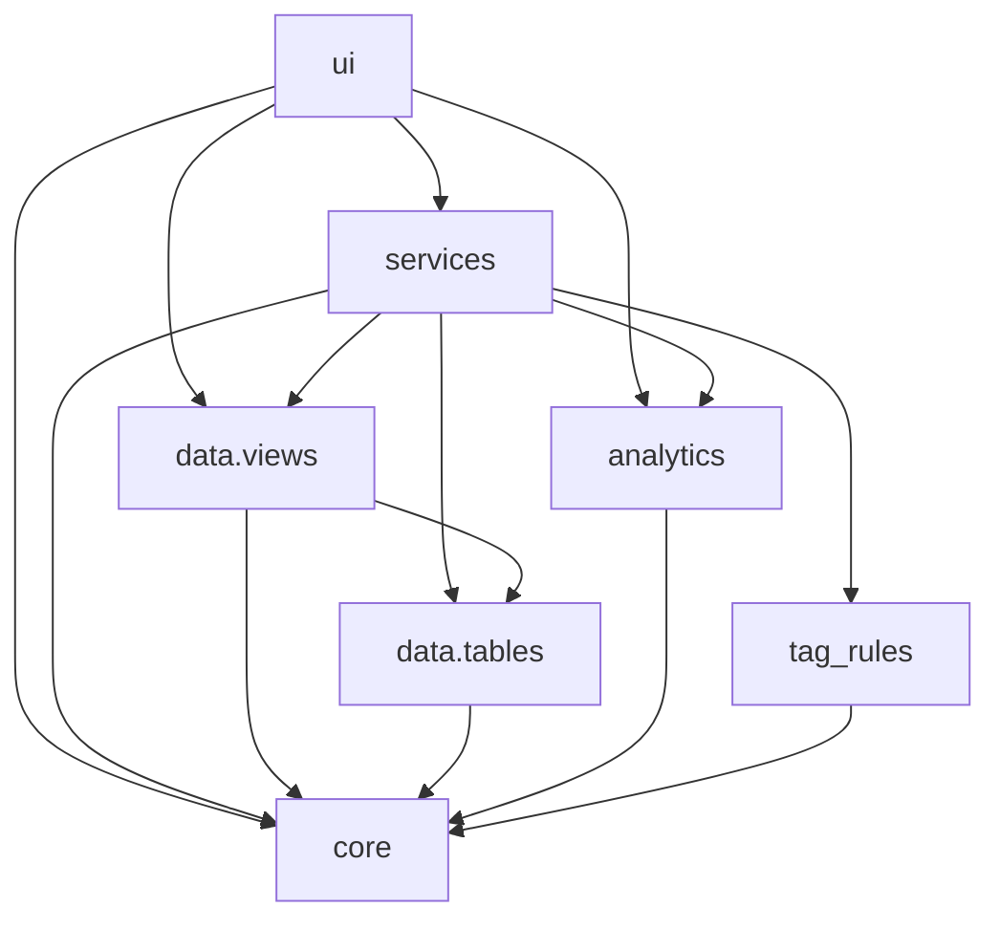

# Architecture

Flathold is a Streamlit app with explicit separation between **UI**, **orchestration**, **data access**, and **pure analytics**.

## Package layout

Under `src/flathold/`:

- `ui/`
  - Streamlit entrypoint and pages.
  - Contains **no persistence IO** (no `write_deltalake`, no deleting `db/*`).
  - Imports: `services.*`, `data.views.*`, `analytics.*`, `core.*`.

- `services/`
  - Use-cases/orchestration (e.g. “refresh tags from rules”).
  - May call table writers/readers and derived views.
  - Contains **no Streamlit**.

- `data/`
  - `data/tables/`: persisted datasets (source of truth) backed by Delta tables.
  - `data/views/`: derived datasets computed on read (not source of truth).
  - Contains **no Streamlit**.

- `analytics/`
  - Pure Polars transforms.
  - Contains **no IO** and **no Streamlit**.

- `core/`
  - Business concepts + invariants (enums/dataclasses/validators).
  - Contains **no IO** and **no Streamlit**.

- `tag_rules/`
  - Tag rule definitions and application logic.

## Dependency rules (what may import what)

## Naming conventions
- Persisted, source-of-truth datasets are named `*_table` (modules) and accessed with functions like `read_*_table()` / `write_*_table()`.
- Derived datasets computed on read are named `*_view` and accessed with functions like `read_*_view()` / `get_*_view()`.
- Avoid naming anything “ledger table” if it is derived. Use “ledger view”.
