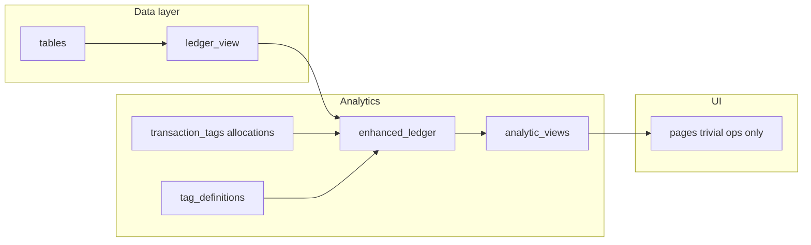
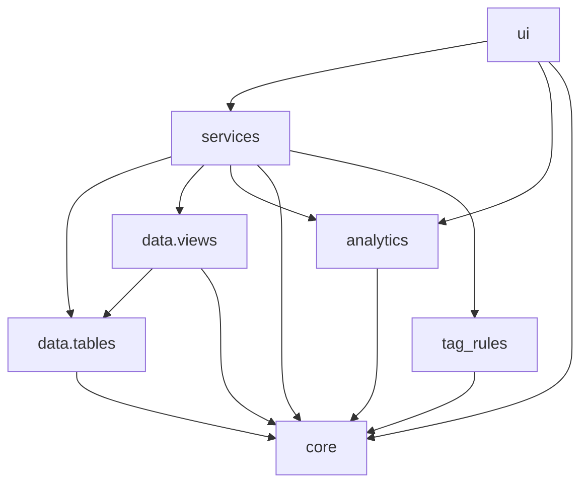

# Architecture

Flathold is a Streamlit app with explicit separation between **UI**, **orchestration**, **data access**, and **pure analytics**.

## Package layout

Under `src/flathold/`:

- `ui/`
  - Streamlit entrypoint and pages.
  - Contains **no persistence IO** (no `write_deltalake`, no deleting `db/*`).
  - Imports **only** `services.*`, `analytics.*`, `core.*` — not `data.*` or `tag_rules.*` (use `services` for table/view IO and tag-rule use-cases).
  - **Must** obtain metrics and chart series from `flathold/analytics` (analytic views built on the enhanced ledger model).
  - **Must not** implement analytics in UI modules (including multi-step Polars pipelines for metrics, allocations, or chart series).
  - **May** apply only trivial operations on analytic outputs: filtering, date-range selection, `sum` / `mean`, and presentation (Streamlit/Altair wiring, formatting).
  - Some pages still contain heavier Polars until refactored; treat that as technical debt — do not add new violations.

- `services/`
  - Use-cases/orchestration (e.g. “refresh tags from rules”).
  - May call table writers/readers and derived views.
  - Contains **no Streamlit**.

- `data/`
  - `data/tables/`: persisted datasets (source of truth) backed by Delta tables.
  - `data/views/`: derived datasets computed on read (not source of truth).
  - Contains **no Streamlit**.

- `analytics/`
  - Pure Polars transforms; **no IO** and **no Streamlit** (callers pass in frames from `data/views` / `data/tables`).
  - Owns the **enhanced ledger** (base ledger + allocations + tag metadata + calculated-tag derivation) and **analytic views** (narrow aggregates for screens: daily/monthly series, rollups).

- `core/`
  - Business concepts + invariants (enums/dataclasses/validators).
  - Contains **no IO** and **no Streamlit**.

- `tag_rules/`
  - Tag rule definitions and application logic.

## Analytics pipeline

End state: **base ledger** (`data/views/ledger_view`) → **enhanced ledger** (in `analytics/`) → **analytic views** (functions in `analytics/`) → **UI** (filter / sum / mean / chart wiring only).

See `docs/data-model.md` for base vs enhanced ledger.

## Dependency rules (what may import what)

## Naming conventions
- Persisted, source-of-truth datasets are named `*_table` (modules) and accessed with functions like `read_*_table()` / `write_*_table()`.
- Derived datasets computed on read under `data/views/` are named `*_view` and accessed with functions like `read_*_view()` / `get_*_view()`.
- Avoid naming anything “ledger table” if it is derived. Use “ledger view”.
- The **enhanced ledger** lives in `analytics/` (e.g. `enhanced_ledger` module or `build_enhanced_ledger(...)`) so it is not confused with `data/views/*_view.py`.
